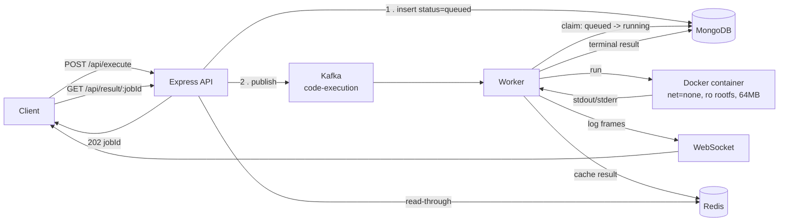

# CodeRank

An online judge backend that runs untrusted code in disposable Docker
containers. Submissions are queued through Kafka, executed by a separate worker
pool, persisted in MongoDB, and cached in Redis. Supports Python, C++, Java, and
JavaScript.

The interesting part isn't running the code — it's reporting *why* it failed.
CodeRank distinguishes compile errors, runtime errors, time-limit-exceeded, and
memory-limit-exceeded as separate outcomes rather than collapsing them into one
generic failure.

## How it works



The ordering matters in two places:

- The job row is written as `queued` **before** the Kafka publish. The worker is
  usually local and wins the race, so writing `queued` after the publish would
  overwrite the worker's `running`.
- Only **terminal** results are cached. Caching a transient status would pin it
  for the full TTL with nothing to invalidate it.

## Tech stack

| Layer | Choice |
|---|---|
| API | Node.js, Express 5 |
| Queue | Kafka (KafkaJS), manual offset commits |
| Execution | Docker via dockerode, one container per submission |
| Persistence | MongoDB + Mongoose |
| Cache | Redis |
| Live logs | WebSocket (`ws`), attached to the HTTP server |
| Tests | Jest, SuperTest, `mongodb-memory-server` |
| Load testing | autocannon |

## Getting started

### Prerequisites

Node.js 18+, Docker, and a MongoDB instance (local or Atlas).

### 1. Install

```bash
git clone https://github.com/Hanish0925/CodeRank.git
cd CodeRank
npm install
```

### 2. Configure

```bash
cp .env.example .env
```

Fill in `MONGO_URI`. Everything else has a working local default. `.env` is
gitignored — do not commit it.

### 3. Start the infrastructure

```bash
docker compose -f docker-compose.kafka.yml up -d
docker compose -f docker-compose.redis.yml up -d
```

Kafka is on `9092`, Redis on `6379`, and Kafka UI on
[localhost:8080](http://localhost:8080).

### 4. Build the language images

```bash
docker buildx build -t coderank-python -f docker/python/Dockerfile .
docker buildx build -t coderank-cpp    -f docker/cpp/Dockerfile .
docker buildx build -t coderank-java   -f docker/java/Dockerfile .
docker buildx build -t coderank-node   -f docker/node/Dockerfile .
```

### 5. Run

The API and the worker are separate processes — run each in its own terminal:

```bash
npm start     # Express API on :3000   (npm run dev for watch mode)
npm run worker # Kafka consumer         (npm run worker:dev for watch mode)
```

Both handle `SIGINT`/`SIGTERM` and drain their connections before exiting.

Open `TestPage.html` in a browser for a minimal submit-and-poll UI.

## API

| Method | Route | Description |
|---|---|---|
| `POST` | `/api/execute` | Queue a submission. Returns `202` with `{ jobId, status: "queued" }`. |
| `GET` | `/api/status/:jobId` | Current job state. |
| `GET` | `/api/result/:jobId` | Same payload as `/status`. |
| `GET` | `/health` | `200` when Mongo and Redis are reachable, `503` otherwise. |

### Submitting

```bash
curl -X POST http://localhost:3000/api/execute \
  -H 'Content-Type: application/json' \
  -d '{"language":"python","code":"print(sum(int(x) for x in input().split()))","input":"1 2 3"}'
```

`language` is one of `python`, `cpp`, `javascript`, `java`. `input` is optional
and is piped to stdin.

### Reading the result

```bash
curl http://localhost:3000/api/result/<jobId>
```

```json
{
  "success": true,
  "jobId": "...",
  "status": "completed",
  "output": "6",
  "exitCode": 0,
  "durationMs": 812,
  "truncated": false,
  "createdAt": "...",
  "startedAt": "...",
  "completedAt": "...",
  "cached": true
}
```

### Execution outcomes

`status` is `pending` → `queued` → `running` → `completed` | `error`. A job that
ends in `error` carries an `errorType` naming the actual failure:

| `errorType` | Meaning | Detected by |
|---|---|---|
| `compile_error` | Compilation failed | Entrypoint exits with sentinel code `101` |
| `runtime_error` | Program exited non-zero (traceback, segfault, `exit(1)`) | `container.wait()` → `StatusCode` |
| `timeout` | Exceeded `EXECUTION_TIMEOUT_MS` | Container killed by the executor |
| `memory_limit` | Exceeded the 64 MB cap | `container.inspect()` → `State.OOMKilled` |
| `unsupported_language` | Unknown `language` value | Validated at the API |
| `internal` | Worker or infrastructure failure | — |

`truncated: true` means output hit `MAX_OUTPUT_BYTES` and the container was
stopped early rather than left to run out its timeout producing discarded logs.

### WebSocket log streaming

Connect to `ws://localhost:3000`, send the `jobId` as the first message, then
receive `jobId:<chunk>` frames as the container writes them.

```js
const ws = new WebSocket('ws://localhost:3000');
ws.onopen = () => ws.send(jobId);
ws.onmessage = e => console.log(e.data);
```

## Configuration

All values are optional except `MONGO_URI`.

| Variable | Default | Purpose |
|---|---|---|
| `PORT` | `3000` | API port |
| `MONGO_URI` | — | MongoDB connection string |
| `REDIS_URL` | `redis://localhost:6379` | Redis connection |
| `KAFKA_BROKER` | `localhost:9092` | Comma-separated broker list |
| `EXECUTION_TIMEOUT_MS` | `10000` | Wall-clock limit per submission |
| `MAX_OUTPUT_BYTES` | `10000` | Output cap before the container is killed |
| `MAX_CONCURRENT_CONTAINERS` | `4` | Hard ceiling on simultaneous containers |
| `KAFKA_CONCURRENCY` | `4` | Partitions consumed concurrently |
| `MAX_BODY_SIZE` | `64kb` | Request body cap |
| `RATE_LIMIT_MAX` / `RATE_LIMIT_WINDOW_MS` | `10` / `60000` | Submission rate limit, per IP |
| `READ_RATE_LIMIT_MAX` / `READ_RATE_LIMIT_WINDOW_MS` | `120` / `60000` | Status/result rate limit, per IP |
| `CORS_ORIGINS` | unset (any origin) | Comma-separated allowlist |
| `REAPER_INTERVAL_MS` | `60000` | How often to sweep for stuck jobs |
| `REAPER_RUNNING_GRACE_MS` | `6 × EXECUTION_TIMEOUT_MS` | Before a `running` job is failed |
| `REAPER_QUEUED_GRACE_MS` | `600000` | Before a never-consumed job is failed |

### Scaling throughput

The topic defaults to a single partition, so jobs run strictly one at a time.
To raise throughput, add partitions and run more workers:

```bash
docker exec coderank-kafka kafka-topics.sh --alter \
  --topic code-execution --partitions 4 \
  --bootstrap-server localhost:9092
```

`MAX_CONCURRENT_CONTAINERS` stays the backstop — partitions increase parallelism,
the semaphore keeps it from becoming unbounded container spawning.

## Security model

Each submission runs in a throwaway container with:

- `NetworkMode: none` — no network access at all
- `CapDrop: ALL` and `no-new-privileges`
- `ReadonlyRootfs`, with source bind-mounted read-only at `/src`; the entrypoint
  copies it into a 64 MB tmpfs at `/code`, so a submission cannot fill the host disk
- 64 MB memory, no swap, 0.5 CPU, `PidsLimit: 50`
- A wall-clock timeout and an output cap, both enforced by the executor

At the API layer: a 64 KB body cap, per-IP rate limiting, a CORS allowlist, and
input validation on language and payload size.

> **There is no authentication on `/api/execute`.** Anyone who can reach the
> endpoint can spawn containers. Do not expose this to the public internet
> without putting auth in front of it.

## Reliability

- **Manual offset commits.** Offsets are committed only after a job reaches a
  terminal state, so a worker that dies mid-execution gets its message
  redelivered instead of silently dropping the job.
- **Conditional claims.** A worker claims a job with a guarded
  `findOneAndUpdate`, so a redelivered message can't re-run finished work.
- **Stuck-job reaper.** Sweeps jobs abandoned in `running` (crashed worker) or
  stranded in `queued` (broker never delivered) into a terminal state.

## Testing

```bash
npm run test:api      # HTTP-level tests — no Docker needed
npm run test:executor # container tests — needs Docker + the images built
npm test              # everything
```

`tests/api.test.js` drives real Express routing with SuperTest against an
in-memory MongoDB, with Kafka and Redis mocked. It covers validation, the body
cap, rate limiting, the caching rules, and the queued-before-publish ordering.

`tests/codeExecutor.test.js` runs real containers and asserts each of the four
failure outcomes.

### Load testing

With the API and worker running:

```bash
npm run loadtest   # autocannon, 20 connections for 30s against /api/execute
```

## Maintenance

```bash
docker container prune   # remove stopped containers
docker image prune       # remove dangling images
```

## Project layout

```
app.js                    Express app, middleware, /health
index.js                  API entrypoint, graceful shutdown
worker.js                 Worker entrypoint, starts the reaper
wsServer.js               WebSocket registry, keyed by job id
config/                   db, redis, kafka clients
controllers/              request handling and validation
services/
  codeExecutor.js         container lifecycle and outcome classification
  kafkaProducer.js        long-lived producer
  jobReaper.js            sweeps abandoned jobs
  semaphore.js            concurrency ceiling
worker/jobConsumer.js     Kafka consumer, manual commits
docker/<lang>/            Dockerfile + entrypoint per language
tests/                    api (SuperTest) and executor (Docker) suites
```
